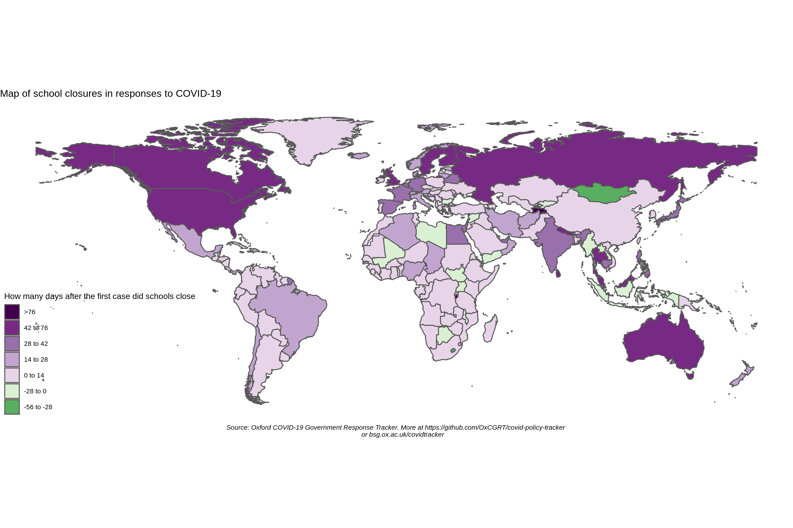

# Oxford Covid-19 Government Response Tracker (OxCGRT)

The Oxford Covid-19 Government Response Tracker (OxCGRT) collects systematic information on which governments have taken which measures, and when. This can help decision-makers and citizens understand the stringency of governmental responses in a consistent way, aiding efforts to fight the pandemic. The OxCGRT systematically collects information on several different common policy responses governments have taken, scores the stringency of such measures, and aggregates these scores into a common Stringency Index.

This is a project from the [Blavatnik School of Government](www.bsg.ox.ac.uk). More information on the OxCGRT is available on the school's website: https://www.bsg.ox.ac.uk/covidtracker. This README contains information about using the database.

---

__Cite as:__ Thomas Hale, Sam Webster, Anna Petherick, Toby Phillips, and Beatriz Kira. (2020). _Oxford COVID-19 Government Response Tracker_. Blavatnik School of Government.

---

## The database

OxCGRT collects publicly available information on 13 indicators of government response (S1-S13). This information is collected by a team of over 100 volunteers from the Oxford community and is updated continuously.

### Individual policy measures

Seven of the indicators (S1-S7) record policies around containment and social isoaltion, such as school closures and restrictions in movement. These are recorded on an ordinal scale that represents the level of strictness of the policy. Two of the indicators (S12 and S13) represent policies around testing and contact tracing, also recorded on an ordinal scale. The remainder (S8-S11) are financial indicators such as fiscal or monetary measures.

Six of the indicators (S1-S6) also have a flag for whether they are targeted to a specific geographical region (isgeneral=0) or whether they are a "general" policy that is applied countrywide (isgeneral=1).

- S1 - school closures (plus targeted/genral flag)
- S2 - workplace closures (plus targeted/gemeral flag)
- S3 - cancellation of public events (plus targeted/general flag)
- S4 - public transport closures (plus targeted/general flag)
- S5 - public information campaign (plus targeted/general flag)
- S6 - restrictions on domestic/internal movement (plus targeted/general flag)
- S7 - restrictions on international travel
- S8 - economic stimulus measures
- S9 - central bank interest rate
- S10 - emergency investment in healthcare
- S11 - investment in vaccines
- S12 - testing policy
- S13 - contact tracing policy

### Our working paper has more information

We have published a [working paper](https://www.bsg.ox.ac.uk/research/publications/variation-government-responses-covid-19) with our methodology, data collection protocols, and description of the individual indicators.

### Stringency index

The Stringency Index is an aggregation of the first seven indicators, S1 to S7. It reports a number between 0 to 100 that reflects the overall stringency of the governments response. This is a measure of how many of the first seven indicators (mostly around social isolation) a government has acted upon, and to what degree.

It does not take into account any fiscal or monetary responses (indicators S8-S11) or policies around testing and contact tracing (S12 and S13).

We have published a [short note with a detailed explanation](https://www.bsg.ox.ac.uk/sites/default/files/Calculation%20and%20presentation%20of%20the%20Stringency%20Index.pdf) of how the stringency index is calculated, and also how it is reported for days with incomplete data are handled.

## Using OxCGRT data

The OxCGRT is updated continuously in real time. There are numerous ways you can access the raw data.

### Getting data through our API
The most direct way to get real-time data from the OxCGRT is through our API. Documentation for this is [published here](https://covidtracker.bsg.ox.ac.uk/about-api).

### Getting data from this repo
 <-- status of connection to OxCGRT database

The [/data](data/) folder in this repository contains recent exports from the OxCGRT. You are welcome to build applications that draw directly from this repo.
- The CSV file [/data/OxCGRT_latest.csv](data/OxCGRT_latest.csv) is a full export from the database presented in "list" format with each country-day as a single row. This CSV is updated every half hour from the main database, and the badge above shows whether this data link is functioning correctly.
- The [/data/timeseries](data/timeseries/) folder contains individual CSV timeseries for each indicator, as well as a combined Excel file with a tab for each indicator. This is updated periodically – the date will be listed at the bottom of each sheet.

### Data quality

It is important to understand the limitations of this dataset, most of which stem from the "live" nature of data collection. Our first goal is to publish a real-time dataset; but this carries risks. For instance, you may get a version of the database that was been exported just as one of our team was half-way through entering new data, or that was exported in the short window between an error being made and being fixed.

For details on how these issues around patchy or missing data affect our Stringency Index, please see our [short note on calculating the Stringency Index](https://www.bsg.ox.ac.uk/sites/default/files/Calculation%20and%20presentation%20of%20the%20Stringency%20Index.pdf).

- **Not all countries are up to date**. We try to ensure that all countries are updated at least once a week, and most are updated more frequently. But there will inevitably be "patchiness" within the last week.
- **For each country, some indicators will be missing in some days**. As our data collectors find information, they will update a country in real time. This means a country may only have up-to-date information for some indicators, but not all.
- **Some indicators and Stringency Index values will be changed retroactively.** We aim to have a second pair of eyes review every data point in the OxCGRT. As at 12 April 2020, we had over 150,000 data points with a little bit over a third having been reviewed so far. The majority of data points are yet to be reviewed. Inevitably, some things may be tweaked in this review process, leading to changes to past dates. This is one reason why you should always make sure you are using current data from the OxCGRT.
- **Zeroes are not the same as null values**. The gaps described above -- where countries are not up to date, or where some indicators are missing -- will be represented as null values. These should not be interpreted as a 0, although for the purposes of calculating our Stringency Index, we conservatively treat them as such.
- **Notes, sources and references are available through the API**. For each indicator our data collectors also record notes which have sources, references and sometimes a brief description of the policy setting. These are not included with the data here in this repo, but can be accessed through [our API](https://covidtracker.bsg.ox.ac.uk/about-api).

## Sample analysis

Here are several examples of the type of analysis enabled by OxCGRT:

