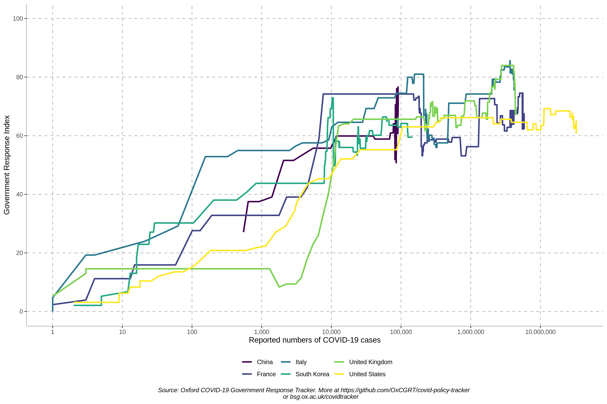
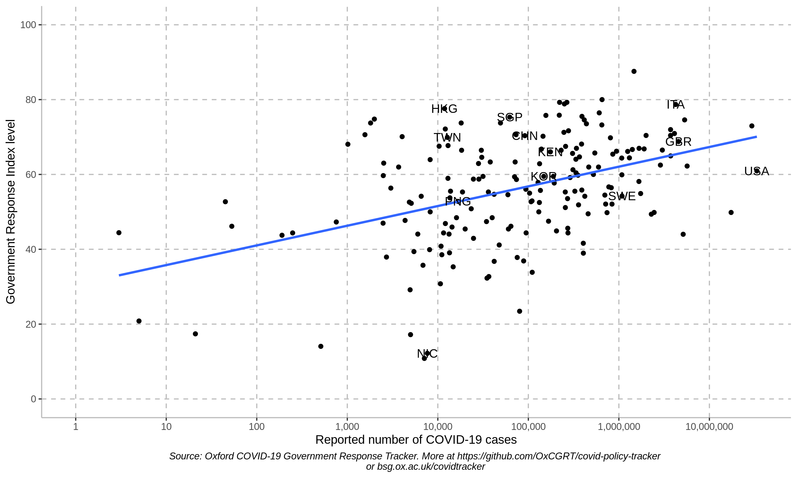
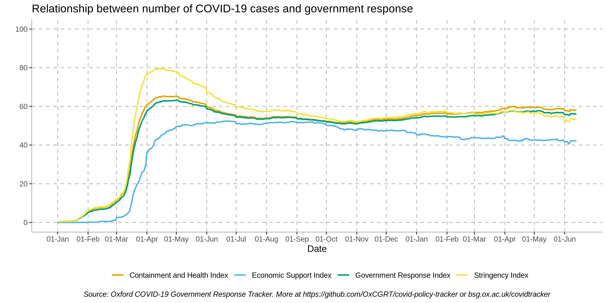
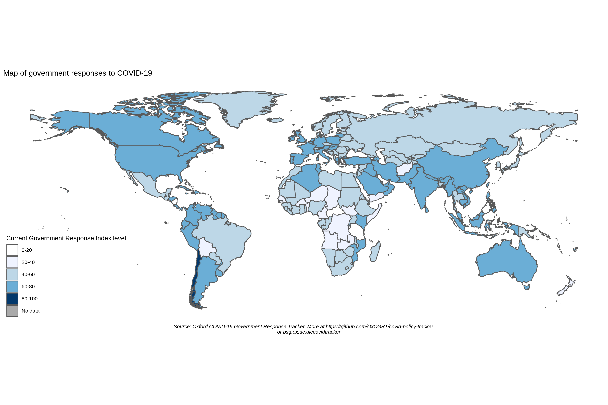

**UPDATE:**

<!---- 
- We have published a new format for our indicators ([/data/OxCGRT_latest_combined.csv](data/OxCGRT_latest_combined.csv)) which combines our ordinal measures of policy strictness with their geographical scope. This is described [below](#getting-data-from-this-github-repository).
-  Our main datasets in this repository also include Brazilian state data.
-  we have published a new indicator for vaccine policy, H7
- We have changed our data source for cases and deaths from the European Centre for Disease Prevention and Control ([ECDC](https://www.ecdc.europa.eu/en)) to the [JHU CSSE data repository](https://github.com/CSSEGISandData/COVID-19) for all countries and the US States. Data sources for the UK nations and Brazil states remain unaltered.
-  We are creating a mailing list to provide technical users with slightly more detailed release notes, and advance warning of changes to database structure. You can register for these email updates here: http://eepurl.com/hiMsdL 
- We have updated our new academic citation for the project
- We have added a new indicator, H8 Protection of elderly people to our datasets 
-->
- We have added data for 3 new indicators on vaccination policies in a standalone CSV
- We have included subnational data for Chinese provincial-level jurisdictions in our main data product
- We have a mailing list to provide technical users with slightly more detailed release notes, and advance warning of changes to database structure. You can register for these email updates here: http://eepurl.com/hiMsdL

---

# Oxford Covid-19 Government Response Tracker (OxCGRT)

The Oxford Covid-19 Government Response Tracker (OxCGRT) collects systematic information on which governments have taken which measures, and when. This can help decision-makers and citizens understand governmental responses in a consistent way, aiding efforts to fight the pandemic. The OxCGRT systematically collects information on several different common policy responses governments have taken, records these policies on a scale to reflect the extent of government action, and aggregates these scores into a suite of policy indices.

This is a project from the [Blavatnik School of Government](www.bsg.ox.ac.uk). More information on the OxCGRT is available on the school's website: https://www.bsg.ox.ac.uk/covidtracker. This README contains information about using the database.

---
#### Citing our data

Our data is made available free to use for any purpose under a Creative Commons CC BY 4.0 license (see: [our license](https://github.com/OxCGRT/covid-policy-tracker/blob/master/LICENSE.txt), and a [summary of CC BY 4.0](https://creativecommons.org/licenses/by/4.0/) at Creative Commons), this means you must give appropriate credit and link back to our original work. Here are three suggested ways to cite our work:

- _Recommended reference for academic publications_: Thomas Hale, Noam Angrist, Rafael Goldszmidt, Beatriz Kira, Anna Petherick, Toby Phillips, Samuel Webster, Emily Cameron-Blake, Laura Hallas, Saptarshi Majumdar, and Helen Tatlow. (2021). “A global panel database of pandemic policies (Oxford COVID-19 Government Response Tracker).” Nature Human Behaviour. https://doi.org/10.1038/s41562-021-01079-8
- _Short credit for media use (CC BY 4.0 License)_: Oxford COVID-19 Government Response Tracker, Blavatnik School of Government, University of Oxford.
- _Full credit for media use (CC BY 4.0 License)_: Thomas Hale , Noam Angrist , Rafael Goldszmidt , Lucy Ellen, Beatriz Kira , Anna Petherick , Toby Phillips, Samuel Webster, Jessica Anania, Emily Cameron-Blake, Thomas Boby, Laura Hallas, Maria Luciano, Saptarshi Majumdar, Radhika Nagesh, Helen Tatlow, Andrew Wood, and Yuxi Zhang. Oxford COVID-19 Government Response Tracker, Blavatnik School of Government, University of Oxford. Oxford COVID-19 Government Response Tracker, Blavatnik School of Government, University of Oxford.

---

## The database

OxCGRT collects publicly available information on 23 indicators of government response. This information is collected by a team of over 200 volunteers from the Oxford community and is updated continuously.

We also include statistics on the number of reported Covid-19 cases and deaths in each country. These are taken from the [JHU CSSE data repository](https://github.com/CSSEGISandData/COVID-19) for all countries and the US States. 

### Individual policy measures

Full descriptions of the policy indicators and their meaning can be found in our [codebook](documentation/codebook.md). For more detailed guidance about the codebook and how we interpret the indicators, see the [coding interpretation guide](documentation/interpretation_guide.md). This ensures consistency, and standardizes coding across the database.

Eight of the policy indicators (C1-C8) record information on [_containment and closure_ policies](documentation/codebook.md#containment-and-closure-policies), such as school closures and restrictions in movement. Four of the indicators (E1-E4) record [_economic_ policies](documentation/codebook.md#economic-policies) such as income support to citizens or provision of foreign aid. Eight indicators (H1-H8) record [_health system_ policies](documentation/codebook.md#health-system-policies) such as the Covid-19 testing regime or emergency investments into healthcare. Three indicators (V1-V3) record [_vaccination_ policies](documentation/codebook.md#vaccination-policies); a country/region/territory’s priority list, eligible groups, and the individual cost of vaccination.

Finally, we have a [miscellaneous indicator (M1)](documentation/codebook.md#miscellaneous-policies) for notes that do not fit elsewhere.

### Policy indices

To help make sense of the data, we have produced four indices that aggregate the data into a single number. Each of these indices report a number between 0 to 100 that reflects the level of the governments response along certain dimensions. This is a measure of how many of the relevant indicators a government has acted upon, and to what degree. The index cannot say whether a government's policy has been implemented effectively.

- overall government response index (all indicators)
- containment and health index (all C and H indicators)
- stringency index (all C indicators, plus H1 which records public information campaigns)
- economic support index (all E indicators)

(_Note: these only include indicators recorded on ordinal scales, so they all exclude E3, E4, H4, H5, and M1._)

The [documentation folder](documentation/) contains an [index methodology](documentation/index_methodology.md) page explaining how the different indexes are calculated and how they are reported for days with incomplete data. This also describes the methodology for the [legacy stringency index](documentation/index_methodology.md#legacy-stringency-index) which is based on the [old](#legacy-database-structure-from-before-25-April-2020) database structure in place prior to 25 April 2020.

### Subnational data

In addition to country-level data, our primary dataset additionally includes some subnational data. So far we have incorporated data for US states, Brazilian States, UK devolved nations, Canadian provinces and territories, and Chinese provinces into the primary dataset on this covid-policy-tracker repository. These subnational entities are included in our [/data/OxCGRT_latest.csv](data/OxCGRT_latest.csv) and [/data/OxCGRT_latest_withnotes.csv](data/OxCGRT_latest_withnotes.csv). But no other CSVs at this stage.

Subnational data can be interpreted using the main [codebook](documentation/codebook.md), with additional guidance on subnational-specific interpretation available in the [documentation folder](documentation/subnational_interpretation.md). The state data included in our primary dataset aims to describe the overall policy environment that applies to residents of the state or equivalent jurisdiction, and so includes policies set by the national government where those values are more stringent than state-level action. For data that focuses only on subnational policies, see our additional datasets in the [OxCGRT/USA-covid-policy](https://github.com/OxCGRT/USA-covid-policy) and [OxCGRT/Brazil-covid-policy](https://github.com/OxCGRT/Brazil-covid-policy) respositories.

### Our documentation and working papers have more information

The most up-to-date description of database components is here in the [documentation folder](documentation/) of this GitHub repo, which contains a detailed [codebook](documentation/codebook.md), [index methodology](documentation/index_methodology.md), a [coding interpretation guide](documentation/interpretation_guide.md), and notes on [subnational interpretation](documentation/subnational_interpretation.md).

We have also published a national [working paper](https://www.bsg.ox.ac.uk/research/publications/variation-government-responses-covid-19) with our national methodology, data collection protocols, and description of the individual indicators. 

### Legacy database structure (from before 25 April 2020)

Prior to 25 April 2020 the OxCGRT had a structure of 13 indicators (labelled S1-S13). Data up until this point is archived and still available in the [/legacy_data_20200425](legacy_data_20200425/) folder.

## Using OxCGRT data

The OxCGRT is updated continuously in real time. There are numerous ways you can access the raw data.

### Getting data from this GitHub repository
 <-- status of connection to OxCGRT database

The [/data](data/) folder in this repo contains recent exports from the OxCGRT database. You are welcome to build applications that draw directly from this repository.
- The CSV file [/data/OxCGRT_latest.csv](data/OxCGRT_latest.csv) reports country/territory- and state-level data presented in "country/territory-day" format (or "state-day" as the case may be), with a list of all indicators for each country/territory as a single row each day. This CSV is updated every hour from the main database, and the badge above shows whether this data link is functioning correctly.
- The CSV file [/data/OxCGRT_latest_combined.csv](data/OxCGRT_latest_combined.csv) reports country/territory- and state-level data in "country/territory-day" format, but gives a single "combined" value for each indicator. As described in the [codebook](documentation/codebook.md), many of our indicators are recorded across two variables: one that records the _strictness_ of the policy, and one that records its _scope_.
  - This is reported as a combination of the policy level (a number) and the scope flag (a letter: `T` for targetted policies or `G` for general policie; or `F`/`A` flags for indicator E1). For instance, for `C3_Cancel public events` we would have `0`, `1T` (recommend cancelling in some areas), `1G` (recommend cancelling everywhere), `2T` (require cancelling in some areas), `2G` (require cancelling everywhere).
  - We also include a numerical combination, using the same methodology to [calculate compenents for our indices](documentation/index_methodology.md): a targeted policy is considered a half-step lower than a general jurisdiction-wide policy. For instance, for `C3_Cancel public events` we would have `0`, `0.5` (recommend cancelling in some areas), `1` (recommend cancelling everywhere), `1.5` (require cancelling in some areas), `2` (require cancelling everywhere).
- The CSV file [/data/OxCGRT_latest_withnotes.csv](data/OxCGRT_latest_withnotes.csv) reports country/territory- and state-level data in "country/territory-day" format _with_ a column of notes from our data collectors for each indicator. This is also updated every hour from the main database. Please note that some of the comments contain commas and other characters interpreted as a delimiter, and so may cause problems when parsing this CSV file.
- The CSV file [/data/OxCGRT_latest_allchanges.csv](data/OxCGRT_latest_allchanges.csv) reports country/territory-level data with a list of every _change_ to the database. Every time a policy value changes, or every time a note is added to an indicator, it is represented with it's own new row. (This does not include subnational data.)
- The [/data/timeseries](data/timeseries/) folder reports country/territory-level data as individual timeseries for each indicator (except for the non-ordinal indicators E3, E4, H4, H5 and M1) in CSV format, as well as a combined Excel file with a tab for each indicator. This is updated periodically – usually daily – and the date will be listed in the commit description and at the bottom of each sheet. (This does not include subnational data.)
- The CSV file [/data/OxCGRT_US_states_temp.csv](data/OxCGRT_US_states_temp.csv) is a temporary CSV that presents _only US state-level data_ in "state-day" format, with a column of notes from our data collectors for each indicator. This is updated manually.
- The CSV file [/data/OxCGRT_vaccines_full.csv](data/OxCGRT_vaccines_full.csv) reports country/region/territory data presented in "country/region/territory-day" format, for the three summary vaccine indicators (V1, V2, V3) and 50 subcategories for eligible groups for vaccination for each country/region/territory as a single row each day.

### Getting data through our API
You can also get some OxCGRT national-level data through our API. Documentation for this is [published here](https://covidtracker.bsg.ox.ac.uk/about-api).

### Data quality

It is important to understand the limitations of this dataset, most of which stem from the "live" nature of data collection. Our first goal is to publish a real-time dataset; but this carries risks. For instance, you may get a version of the database that was exported just as our team was half-way through entering new data, or that was exported in the window between an error being made and being fixed.

For details on how these issues around patchy or missing data affect our index calculations, please see our [documentation on calculating indices](documentation/index_methodology.md).

- **Be skeptical of reductions in index values**. Incomplete or missing data will sometimes cause a dip in the calculated  index (we conservatively treat some missing values as 0). For most countries, a reduction in index level that is recent, relatively small (less than 10 points), or only lasts a couple of days, is more likely the result of missing data rather than a legitimate reduction in the underlying policy.
- **Not all countries are equally up to date**. We try to ensure that all countries and relevant subnational units are updated at least once a week, and most countries are updated more frequently. But there will inevitably be "patchiness" within the last week.
- **For each country/territory, some indicators will be missing in some days**. As our data collectors find information, they will update a country/territory in real time. This means a country/territory may only have up-to-date information for some indicators, but not all.
- **Some indicators (and therefore, index values) will be changed retroactively.** We aim to have a second pair of eyes review every data point in the OxCGRT. As at 19 May 2020, the majority of our 400,000 data points are yet to be reviewed. Inevitably, some things may be tweaked in this review process, leading to changes to past dates. We recommend you frequently download fresh data from OxCGRT, rather than relying on an old export.
- **Null values are not the same as 0**. The gaps described above – where countries are not up to date, or where some indicators are missing – will be represented as null values. These should not be interpreted as a 0, although for the purposes of calculating our indices, we conservatively treat them as such.
- **Fiscal and monetary indicators are not evenly covered**. We do not yet have comprehensive and high quality coverage of our indicators E3, E4, H4, and H5. You should check the data carefully before using these indicators.

## Sample analysis

Here are several examples of the type of analysis enabled by OxCGRT:

### Analysis of specific countries

An individual chart of each country/territory is in the [/images/country charts](images/country_charts/) folder.

### Global comparisons

